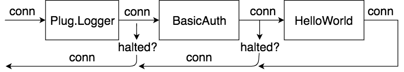

title: Plug Anatomy 
theme: martinos/reveal-cleaver-theme
output: slideshow.html

--
### Martin Chabot
### Twitter : @martinosis
--
# Plug Anatomy
--
## What is Plug ?
--
#### A specification for composable modules between web applications
--
## Hello world Plug
---

```elixir
defmodule HelloWorldPlug do
  import Plug.Conn

  def init(options) do
    # initialize options
    options
  end

  def call(conn, opts) do
    conn
    |> put_resp_content_type("text/plain")
    |> send_resp(200, "Hello world. Time is #{opts[:time] |> inspect}")
  end
end
```

---

## Connection

```elixir
defstruct adapter:         {Plug.MissingAdapter, nil},
            assigns:         %{},
            before_send:     [],
            body_params:     %Unfetched{aspect: :body_params},
            cookies:         %Unfetched{aspect: :cookies},
            halted:          false,
            host:            "www.example.com",
            method:          "GET",
            owner:           nil,
            params:          %Unfetched{aspect: :params},
            path_params:     %{},
            path_info:       [],
            port:            0,
            private:         %{},
            query_params:    %Unfetched{aspect: :query_params},
            query_string:    "",
            peer:            nil,
            remote_ip:       nil,
            req_cookies:     %Unfetched{aspect: :cookies},
            req_headers:     [],
            request_path:    "",
            resp_body:       nil,
            resp_cookies:    %{},
            resp_headers:    [{"cache-control", "max-age=0, private, must-revalidate"}],
            scheme:          :http,
            script_name:     [],
            secret_key_base: nil,
            state:           :unset,
            status:          nil

```

--

Serving a plug

```elixir
 {:ok, _} = Plug.Adapters.Cowboy.http(
              HelloWorldPlug, 
              [time: :calendar.local_time()])
```

--
### With a supervisor

```elixir
  def start(_type, _args) do
    import Supervisor.Spec, warn: false

    # Define workers and child supervisors to be supervised
    children = [
      Plug.Adapters.Cowboy.child_spec(:http, HelloWorldPlug, [time: :calendar.local_time()], [port: 4005])
    ]

    # See http://elixir-lang.org/docs/stable/elixir/Supervisor.html
    # for other strategies and supported options
    opts = [strategy: :one_for_one, name: PlugExample.Supervisor]
    Supervisor.start_link(children, opts)
  end
```
--

## Builder

```elixir
defmodule MyBuildedPlug do
  use Plug.Builder

  plug Plug.Logger 
  plug HelloWorldPlug, [time: :calendar.local_time()]
end
```

---

### How it works?
```elixir
quoted = Plug.Builder.compile(__ENV__, [
  {HelloWorldPlug, [time: :calendar.local_time()], true}, # no guards, as added by the Plug.Builder.plug/2 macro
  {Plug.Logger, [], true}, # no guards, as added by the Plug.Builder.plug/2 macro
], [])

quoted |> Macro.to_string() |> IO.puts()

```

---

```elixir
{conn, case(Plug.Logger.call(conn, :info)) do
  %Plug.Conn{halted: true} = conn ->
    nil
    conn
  %Plug.Conn{} = conn ->
    case(HelloWorldPlug.call(conn, time: {{2017, 10, 29}, {11, 42, 46}})) do
      %Plug.Conn{halted: true} = conn ->
        nil
        conn
      %Plug.Conn{} = conn ->
        conn
      _ ->
        raise("expected HelloWorldPlug.call/2 to return a Plug.Conn, all plugs must receive a connection (conn) and return a connection")
    end
  _ ->
    raise("expected Plug.Logger.call/2 to return a Plug.Conn, all plugs must receive a connection (conn) and return a connection")
end}
```

---
```elixir
defmodule MyBuildedPlug do
  use Plug.Builder

  plug Plug.Logger 
  plug BasicAuth
  plug HelloWorldPlug, [time: :calendar.local_time()]
end
```

---


---

```
conn |> halt
```

---

### How Responses Are Sent To The Client 

```elixir
defmodule HelloWorldPlug do
  import Plug.Conn

  def init(options) do
    # initialize options
    options
  end

  def call(conn, opts) do
    conn
      |> put_resp_content_type("text/plain")
      |> send_resp(200, "Hello world. Time is #{opts[:time] |> inspect}")
  end
end
```

---

### Plug Logger

---

Since every Plug `call` function is called in sequence how can the logger log how long does a request takes?

---

```elixir
  def call(conn, level) do
    Logger.log level, fn ->
      [conn.method, ?\s, conn.request_path]
    end

    start = System.monotonic_time()

    Conn.register_before_send(conn, fn conn ->
      Logger.log level, fn ->
        stop = System.monotonic_time()
        diff = System.convert_time_unit(stop - start, :native, :micro_seconds)

        [connection_type(conn), ?\s, Integer.to_string(conn.status),
         " in ", formatted_diff(diff)]
      end
      conn
    end)
  end
```
---
```elixir
  def send_resp(%Conn{adapter: {adapter, payload}, 
                      state: :set, owner: owner} = conn) do
    conn = run_before_send(conn, :set)
    {:ok, body, payload} = 
       adapter.send_resp(payload, conn.status, 
                         conn.resp_headers, conn.resp_body)
    send owner, @already_sent
    %{conn | adapter: {adapter, payload}, 
             resp_body: body, state: :sent}
  end
```
---
### Conclusion

- Plugs are very composable
- Builders compile plug's `call` functions together
- Use the Plug.Conn.halt function to halt a chain of plugs
- `send_resp` sends the response right away 
- `Conn.register_before_send` can be used for completing a plug execution
---

### Questions?
